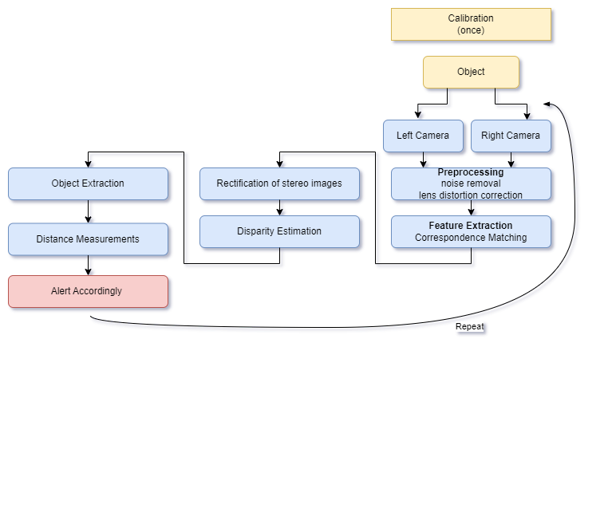

# Project Name
The project aims to help people with visual disabilities navigate their environment more easily and safely. People with visual disabilities often face significant challenges when it comes to mobility and independence such as crossing pavements and navigating through obstacles. This project provides a solution that can assist them in their daily lives.

# Installation
To run the project, you need to have Python 3 installed. You can clone the repository and install the required packages by running the following command in your terminal: pip install -r requirements.txt

# Usage
The project flow is implemented in StereoVision.py. 

# Flow chart

The following is the flow of the project:

1. Calibration - This step is performed only once to calibrate the left and right cameras.

2. Object - In this step, an object is placed in front of the cameras.

3. Left Camera Capture, Right Camera Capture - The left and right camera frames are captured.

4. Preprocessing - Preprocessing is done to remove noise and correct lens distortion.

5. Feature Extraction - Feature extraction is performed by rectifying stereo images and performing correspondence matching.

6. Disparity Estimation - Disparity estimation is done to find the difference between the left and right camera frames.

7. Object Extraction - Object extraction is performed to extract the object from the frames.

8. Distance Measurements - Distance measurements are calculated based on the disparity estimation.

9. Alert Accordingly - An alert is raised based on the distance measurements. If the object is too close, an alert is raised to notify the user.

10. Repeat Capturing - The process is repeated to capture new frames continuously.

# Contributors
The project was created by [Your Name]. If you would like to contribute to the project, please feel free to submit a pull request.

# License
This project is licensed under the [License Name] license. See the LICENSE file for more details.
